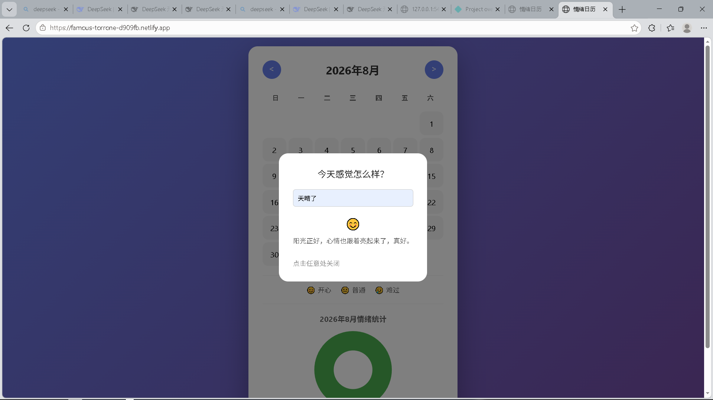

# 情绪日历 Mood Calendar

一个基于 AI 的情绪追踪与可视化日历应用：记录每日心情，AI 识别情绪并给出温暖回应，再用图表查看情绪趋势。

🌐 **在线体验**：https://famous-torrone-d909fb.netlify.app/

[](https://github.com/sin0807/emoji/actions/workflows/test.yml)

## 功能特点

- 📅 **日历视图**：直观展示每日情绪状态，支持月份切换
- 🤖 **AI 情绪分析**：输入一句话，AI 识别情绪（开心 / 普通 / 难过）并生成温暖的个性化回复
- 🔀 **多模型切换**：同一接口支持 DeepSeek / 通义千问 / 豆包，改一个环境变量即可切换
- 📊 **数据可视化**：每月情绪统计图表（Chart.js），清晰看见情绪趋势
- 💬 **语录推荐**：根据情绪状态推送名人名言
- 📱 **响应式设计**：支持移动端访问

## 技术栈

### 前端

| 分类 | 技术 |
|------|------|
| 核心 | 原生 HTML5、CSS3、JavaScript (ES6) |
| 特点 | 无框架，手写 DOM 操作、事件绑定、日历渲染和 localStorage 存储 |
| 图表 | Chart.js (CDN) |

### 后端 / API

| 分类 | 技术 |
|------|------|
| Netlify | Serverless Function（`netlify/functions/analyze.js`） |
| Vercel | Serverless Function（`api/analyze.js`） |
| 本地开发 | FastAPI（`backend/main.py`） |
| AI 模型 | DeepSeek / 通义千问 / 豆包（统一接口，环境变量切换） |
| 工程化 | GitHub Actions 自动测试（push 时跑 `npm test`） |

## 架构

```
浏览器（index.html / script.js）
   │  POST /api/analyze
   ▼
Serverless 函数（Netlify 或 Vercel，持有 DEEPSEEK_API_KEY）
   │  转发请求
   ▼
大模型 API（DeepSeek / 通义千问 / 豆包，环境变量切换）
```

为什么中间要有一层 Serverless 函数？

因为浏览器里保存 API Key 等于公开密钥——任何人打开网页就能偷走，然后刷爆你的额度。由服务器代理转发后，Key 只存在于服务端环境变量里，前端永远接触不到。

## 目录结构

```
.
├── index.html              # 主页
├── style.css               # 样式
├── script.js               # 核心逻辑（DOM、日历、图表、调用 API）
├── package.json            # npm 脚本（npm test 跑测试）
├── netlify.toml            # Netlify 配置（含 /api/analyze 转发）
├── vercel.json             # Vercel 配置
├── api/
│   └── analyze.js          # Vercel Serverless 函数（AI 代理）
├── netlify/
│   └── functions/
│       └── analyze.js      # Netlify Serverless 函数（AI 代理）
├── tests/
│   └── analyze.test.js     # 单元测试（node --test）
├── backend/
│   └── main.py             # FastAPI 本地版后端
├── requirements.txt        # Python 依赖
├── .env.example            # 环境变量示例（复制为 .env）
├── LICENSE
└── .github/
    └── workflows/
        └── test.yml        # GitHub Actions：push 自动跑测试
```

## 效果预览

<!-- 把线上页面截图保存为 screenshot.png 放在项目根目录，这里就会显示 -->


## 快速开始

### 1. 环境变量

项目支持三家大模型服务商，默认使用 DeepSeek，只需要配置当前使用的那一家：

1. **DeepSeek**（默认）：到 [platform.deepseek.com](https://platform.deepseek.com) 创建 Key，配置 `DEEPSEEK_API_KEY`
2. **通义千问**：到 [阿里云百炼](https://bailian.console.aliyun.com) 创建 DashScope Key，配置 `DASHSCOPE_API_KEY`
3. **豆包**：到 [火山方舟](https://console.volcengine.com/ark) 创建 API Key，配置 `ARK_API_KEY`

在部署平台的环境变量设置（或本地 `.env` 文件）中配置：

```
# 当前使用的服务商：deepseek（默认）/ qwen / doubao
MODEL_PROVIDER=deepseek
DEEPSEEK_API_KEY=sk-xxxx

# 切换为通义千问时：
# MODEL_PROVIDER=qwen
# DASHSCOPE_API_KEY=sk-qwen-key

# 切换为豆包时（建议同时设置 MODEL_NAME 为你的模型名或接入点 ID）：
# MODEL_PROVIDER=doubao
# ARK_API_KEY=ark-key
# MODEL_NAME=doubao-xxx
```

前端代码不需要任何改动：`POST /api/analyze` 的请求格式不变，切换服务商只改服务器端环境变量。回复里会带上当前使用的模型名，方便验证切换是否生效。

### 2. 本地运行（前端 + Netlify 函数）

需要 Node.js 18+ 和 Netlify CLI：

```bash
npm install -g netlify-cli
netlify dev
```

打开 http://localhost:8888 即可体验。

### 3. 本地运行（FastAPI 版后端）

```bash
cd backend
pip install -r ../requirements.txt
# 把 ../.env.example 复制为 .env 并填入 Key
uvicorn main:app --reload
```

访问 http://127.0.0.1:8000/docs 查看自动生成的 API 文档。

### 4. 运行测试

```bash
npm test
```

> 如果 PowerShell 提示"禁止运行脚本"，直接用 `node --test tests/analyze.test.js` 效果一样。

### 5. 部署到 Netlify

1. 把项目推到 GitHub
2. 在 [Netlify](https://app.netlify.com) 导入仓库，构建命令留空，发布目录为 `.`
3. 在 Site settings → Environment variables 配置 `DEEPSEEK_API_KEY`
4. 部署完成

### 6. 部署到 Vercel

1. 把项目推到 GitHub
2. 在 [Vercel](https://vercel.com) 导入仓库（框架预设选 Other）
3. 在 Settings → Environment Variables 配置 `DEEPSEEK_API_KEY`
4. 部署完成（`api/analyze.js` 会被自动识别为 Serverless 函数）

## 安全设计

- API Key 只存在于服务端环境变量，前端永远接触不到
- 提示词注入防护：指令放在 system 消息，用户输入单独放在 user 消息
- 输入长度限制（500 字）与基础频率限制，防止滥用消耗额度
- 结构化输出：请求模型时启用 JSON 模式，让模型保证返回合法 JSON，并对瞬时上游错误自动重试
- 多模型统一层：DeepSeek / 通义千问 / 豆包共用一套接口，各家密钥独立存放在服务端环境变量
- 上游模型报错只记录日志，不向前端泄露原始内容

## 适用场景

- 情绪管理与自我觉察
- AI 大模型应用实战：结构化输出、Serverless 代理、前后端联调

## License

MIT
